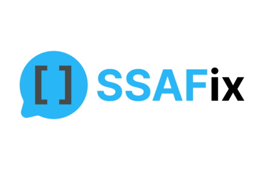
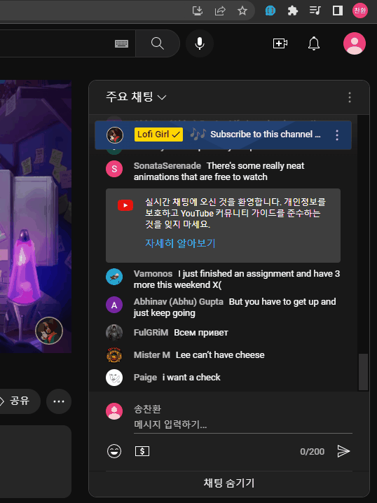
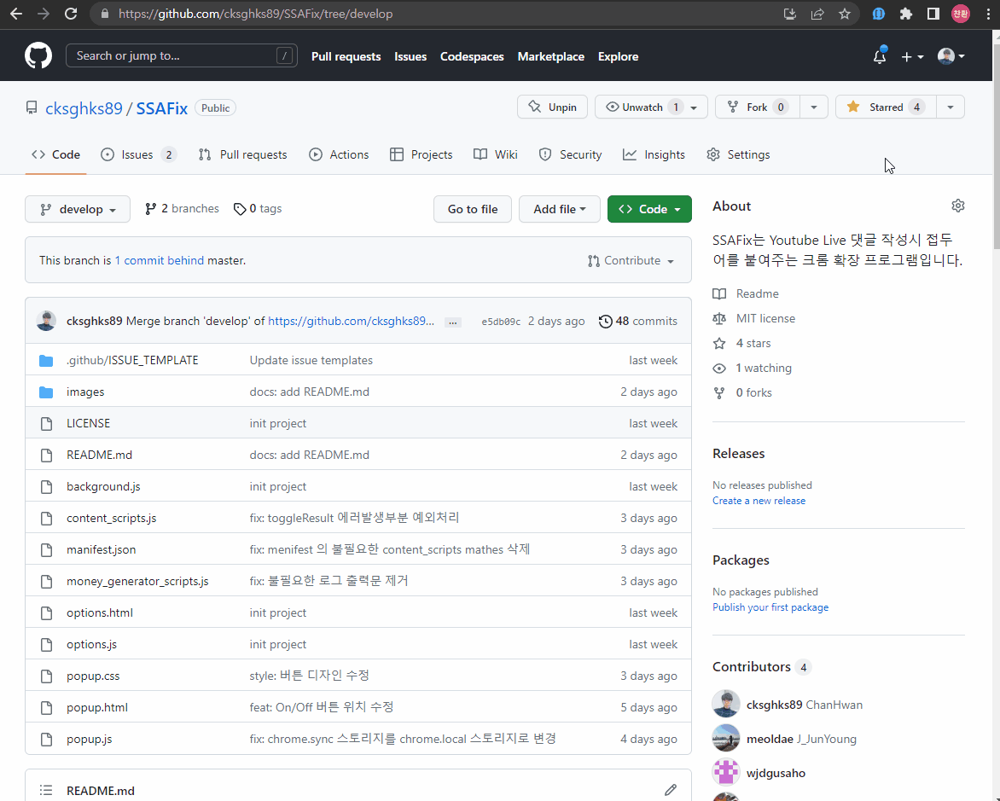

<h1 align="center">
  
   
  SSAFix - Youtube Live Prefix
   
   
</h1>

 

# SSAFix 란?

SSAFix는 SSAFY + Prefix 의 줄임말로 Youtube 라이브 채팅 이용시 접두어를 자동으로 붙여주는 크롬 확장 프로그램입니다.

SSAFix를 이용하면 Youtube 계정의 이름을 변경하지 않고도 설정한 접두어를 이용해 라이브 채팅을 이용할 수 있습니다.

 
 

## Contributors

<table>
  <tbody>
    <tr>
        <td align="center" valign="top" width="14.28%"><a href="https://github.com/cksghks89"> <b>송찬환</b></a> 
        <td align="center" valign="top" width="14.28%"><a href="https://github.com/meoldae"> <b>전준영</b></a> 
        <td align="center" valign="top" width="14.28%"><a href="https://github.com/wjdgusaho"> <b>정현모</b></a> 
        <td align="center" valign="top" width="14.28%"><a href="https://github.com/gmzuddl"> <b>이현욱</b></a> 
    </tr>
  </tbody>
</table>

 
 

## 사용방법

1. 우측 상단의 popup 버튼을 클릭합니다.
2. 중앙의 입력박스에 사용하고자 하는 prefix를 입력하고 저장 버튼을 누릅니다.
3. 하단 on-off 스위치가 켜져 있는지 확인합니다.
4. Youtube Live Chat 으로 들어가 댓글 입력 박스를 클릭하면 자동으로 입력한 prefix가 앞에 삽입됩니다.

 

> SSAFY 교육생을 위한 기능

1. [지역_반_이름] 형태로 prefix를 설정합니다.
2. 하단 교육지원금 서명 생성기 링크를 클릭합니다.
3. 지역, 반, 이름이 자동으로 삽입되어 편리하게 제출 서류를 만들 수 있습니다.

 
 

## 크롬 마켓 다운로드

 

## 동작화면

**Prefix 자동추가 동작화면**

 

**SSAFY 교육지원금 생성기 지역, 반, 이름 자동추가 동작화면**

 

## 기능제안 및 버그신고

